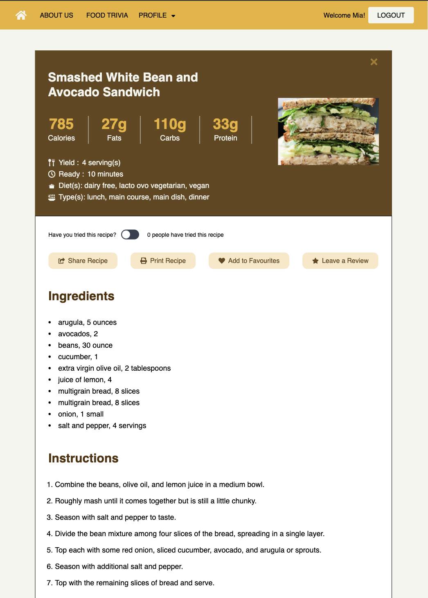
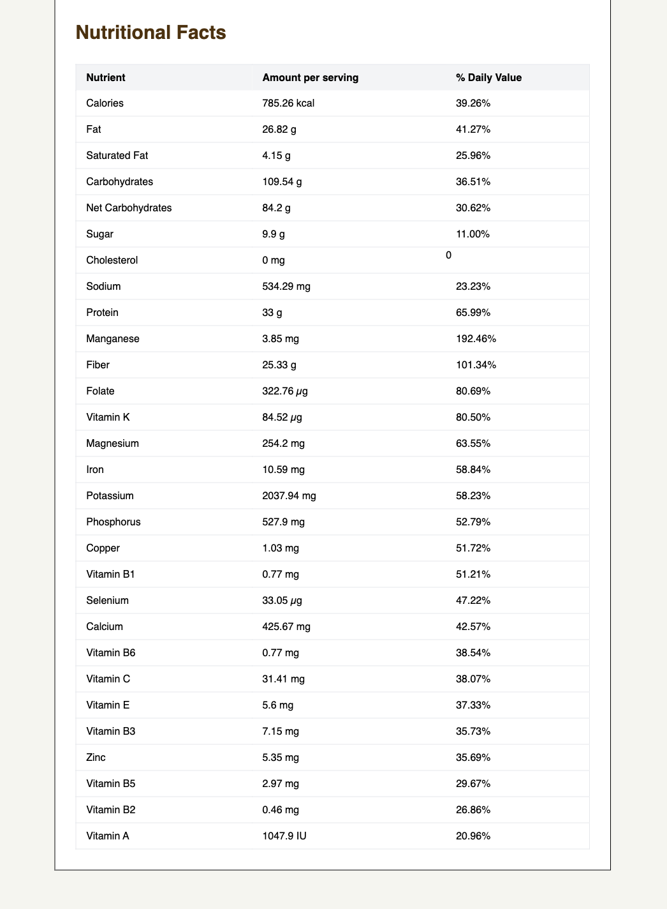
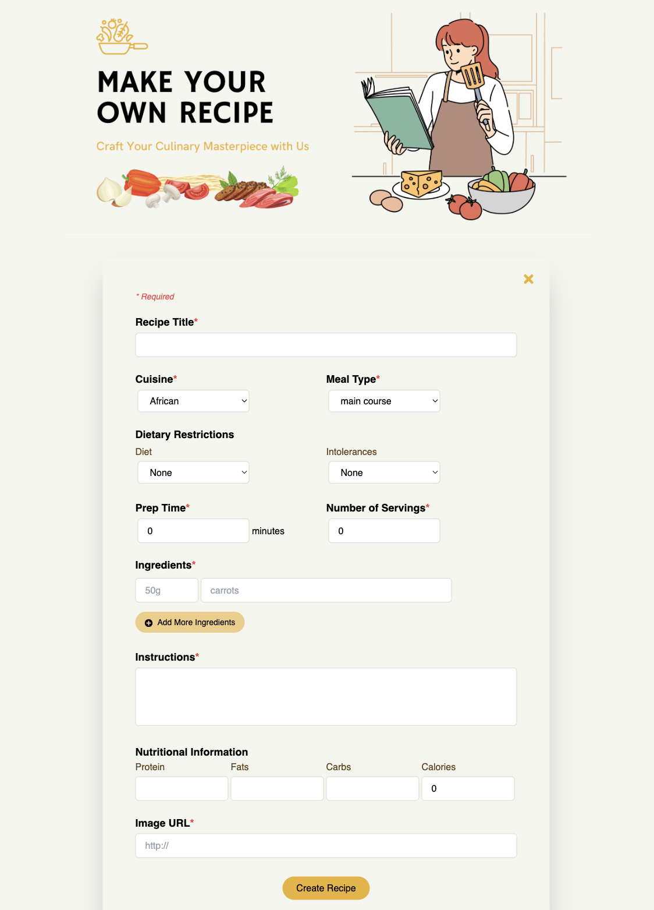
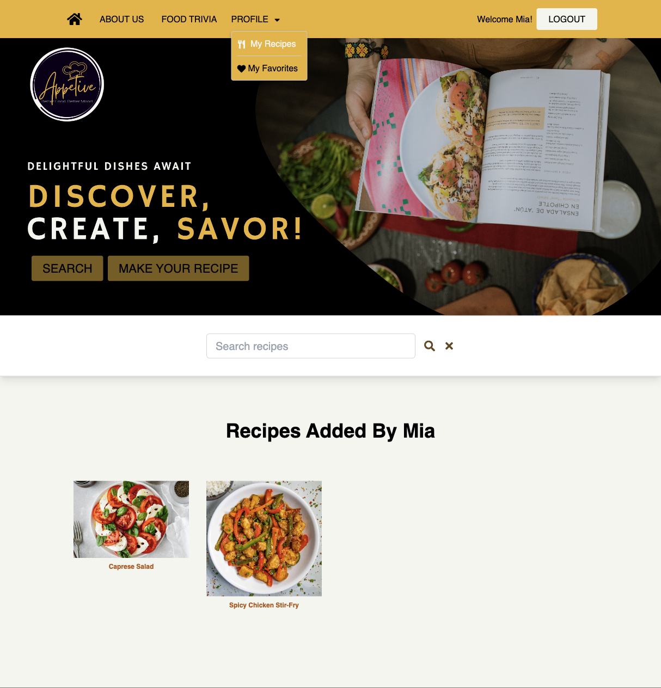
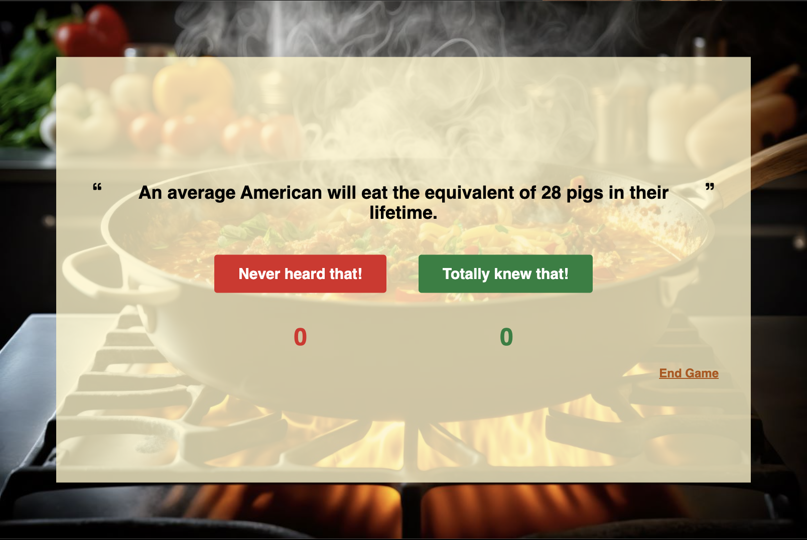

# Appetive
A recipe-sharing platform where users can discover, share, and rate recipes they have tried, providing feedback and recommendations for others. Users can sign up for an account, browse through a collection of recipes, save their favorite recipes, and contribute their recipes to the platform. 

Originally created by Maddie Lee, Mia Dinh, Rosemary Okere, and Hisban Shiraz.

## Tech Stack
### Front End
* React
* Tailwind CSS

### Back End
* Node.js
* Express
* PostgreSQL

## Setup

Install dependencies with `npm install` in each respective `/frontend` and `/backend`.

## [Frontend] Running Webpack Development Server - REACT

```sh
cd frontend
npm start
```

## [Backend] Running Backend Server - EXPRESS

Read `backend/readme` for further setup details.

```sh
cd backend
npm start
```

## Screenshots

### Homepage


### About Page


### Recipe Detail




### Adding Recipe Form


### My Favorites and My Recipes



### Food Trivia


